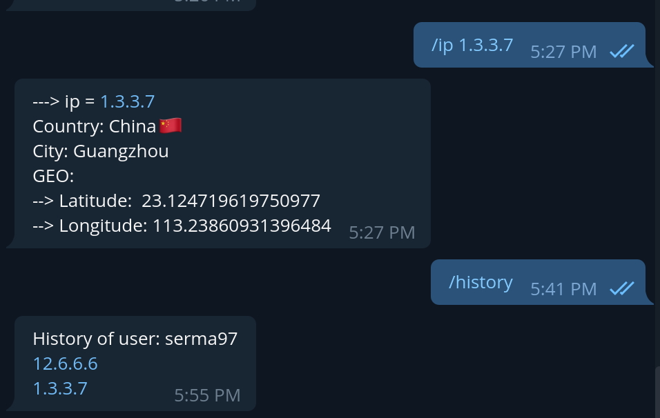

## ipCheckBot
Bot for check ip information
### Workflow

#### Commands:
- For ordinary user:
  - "/ip [some_ipV4]" - show info about <some_ipV4> 
  - "/history" - shows all your requested ips
- For amin:
  - "/admin_new [user_id]" - add to user with <user_id> admin permissions
  - "/admin_delete [user_id]" - take away from user with <user_id> admin permissions
  - "/admin_user_history [user_id]" - show all request of user with <user_id>
  - "/admin_send_all [msg]" - send <msg> to all familiar to bot users

#### Back-end (response in JSON):
- GET "${CLOUD_FUNCTION_URL}/get_users" - give info on all users in bot's database
- GET "${CLOUD_FUNCTION_URL}/get_user?id={user_id}" - give info on user with <user_id>
- GET "${CLOUD_FUNCTION_URL}/get_history_by_tg?id={user_id}" - give info on ip in user with <user_id> history
- GET "${CLOUD_FUNCTION_URL}/get_global_history" - give ip history of all users
- GET "${CLOUD_FUNCTION_URL}/get_history_by_tg?id={history_ID}" - delete one history row with ID <history_ID>

### Set up
For run bot you need to create file `.env` with enviroment varibales:
```env
TELEGRAM_BOT_TOKEN="Your_bot_telegram_token"
IPSTACK_ACCESS_KEY="Your_access_key_for_api_ipstack"
CLOUD_FUNCTION_URL="Your_hosting_url_or_tunnel_to_localhost"
```
Then just run in root of this repository
```shell
docker-compose up
```
